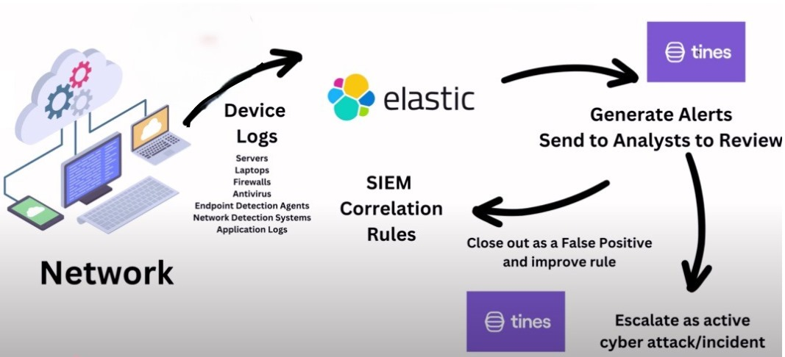
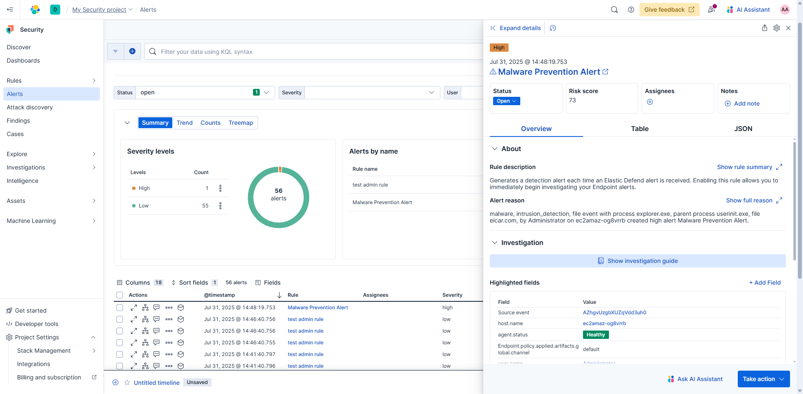
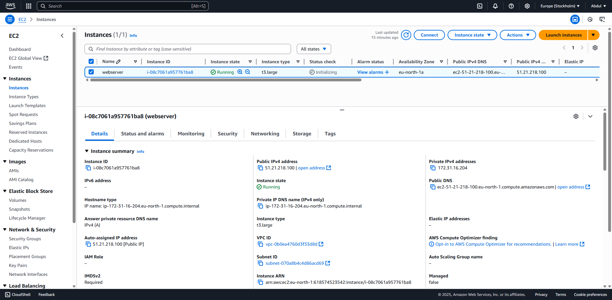
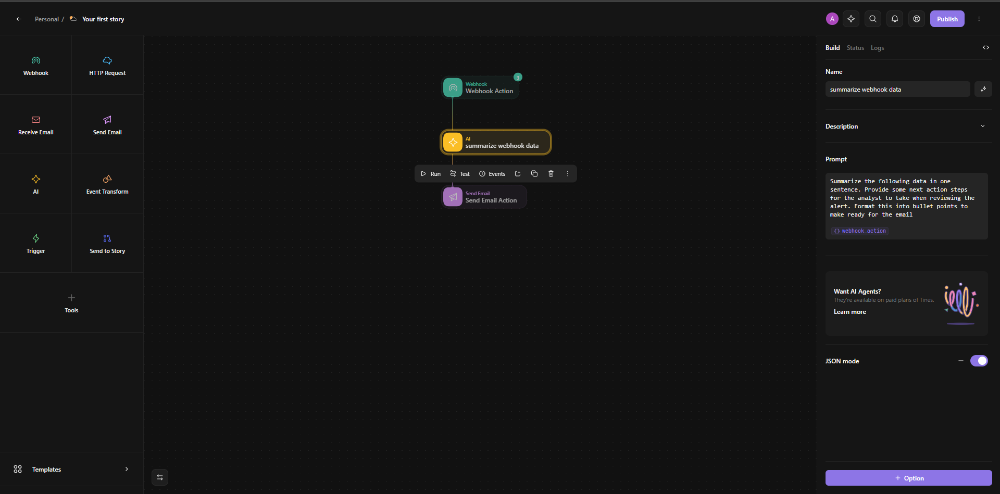

# AI-Integrated-Threat-Detection-and-Response-Framework
This project is a home lab implementation of a Security Information and Event Management (SIEM) solution that monitors and detects malicious actions on a Windows Server, leveraging Elastic SIEM and automating responses through AI-driven workflows in Tines.

## Project Architecture

The architecture consists of a Windows Server hosted on AWS EC2, integrated with Elastic SIEM for threat detection and monitoring. Elastic Defend agents collect and send security data to Elastic SIEM, where custom rules are defined to identify malicious activities, and relevant events are forwarded to Tines for AI-driven workflow automation. Webhooks facilitate communication between Elastic SIEM alerts and Tines, enabling automated actions based on these custom rules.

Data Flow: Server → Elastic Defend → Elastic SIEM (with custom rules) → Tines (via webhooks) → Automated Response

**Components**:
- AWS EC2 instance (Windows Server)
- Elastic SIEM (central monitoring with custom rules)
- Elastic Defend (agent for data collection)
- Tines (AI-driven workflow automation)
  

**What I Learned**
- Gained hands-on experience with SIEM deployment, threat detection, and incident response using Elastic SIEM.
- Developed skills in AI-driven automation by creating custom workflows in Tines to enhance security operations.
- Improved understanding of cloud security on AWS EC2 and agent-based monitoring with Elastic Defend.

**Technology Used**
- Elastic SIEM: For centralized threat monitoring and detection.
- Elastic Defend Integration : For endpoint data collection and security event reporting.
- AWS EC2 (Windows Server): Hosted the target environment for testing.
- Tines (Workflow Automation): Enabled AI-driven automation of security responses.

